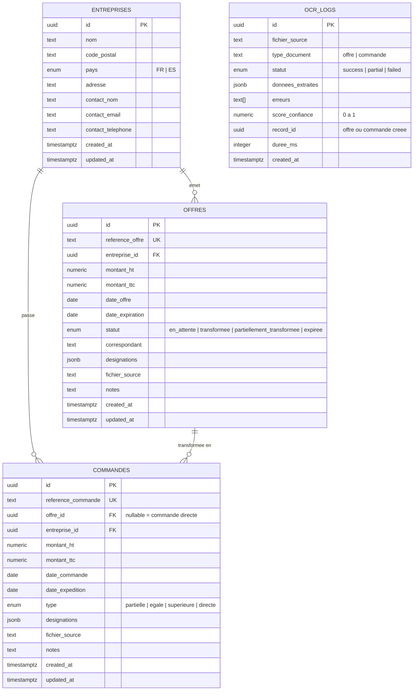

# Schema BDD — ThermoPack Industries

## Diagramme



## Roles et permissions (RLS)

| Role | Entreprises | Offres | Commandes | OCR Logs |
|------|-------------|--------|-----------|----------|
| **admin** (Éric Martin) | Lecture + Ecriture + Suppression | Lecture + Ecriture + Suppression | Lecture + Ecriture + Suppression | Lecture |
| **commercial** (Alice) | Lecture + Ecriture | Lecture + Ecriture | Lecture + Ecriture | Lecture |
| **comptable** (Gabrielle Petit) | Lecture | Lecture | Lecture | — |
| **service_role** (n8n / Edge Functions) | Acces complet | Acces complet | Acces complet | Acces complet |

## Fonctions SQL

| Fonction | Role | Description |
|----------|------|-------------|
| `rapprocher_commande(id)` | Rapprochement | Classe la commande (partielle/egale/superieure/directe) et met a jour le statut de l'offre |
| `taux_transformation(date_debut?, date_fin?, pays?)` | KPI | Calcule le taux de transformation avec filtres optionnels |
| `offres_a_relancer(jours?)` | Relances | Liste les offres non transformees proches de l'expiration |
| `expirer_offres()` | Maintenance | Passe en "expiree" les offres depassees (cron) |

## Statuts offre

```
en_attente → transformee (commande recue = montant offre)
en_attente → partiellement_transformee (commande recue < montant offre)
en_attente → expiree (date_expiration depassee)
```

## Types de commande

| Type | Condition |
|------|-----------|
| **directe** | Pas de reference offre (offre_id = NULL) |
| **partielle** | Montant commande < montant offre |
| **egale** | Montant commande = montant offre |
| **superieure** | Montant commande > montant offre (upsell) |
